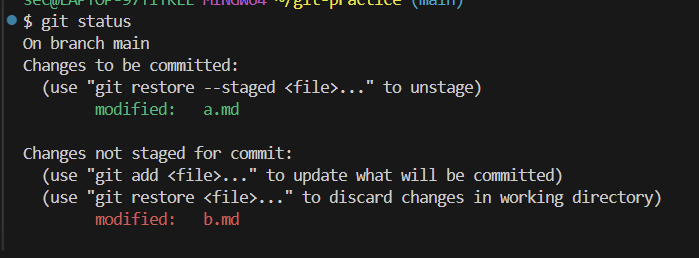
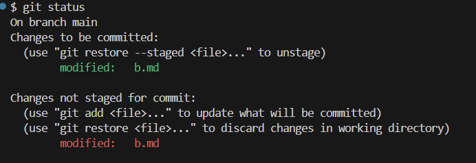
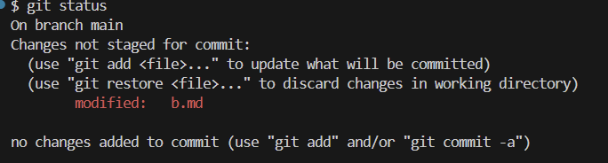
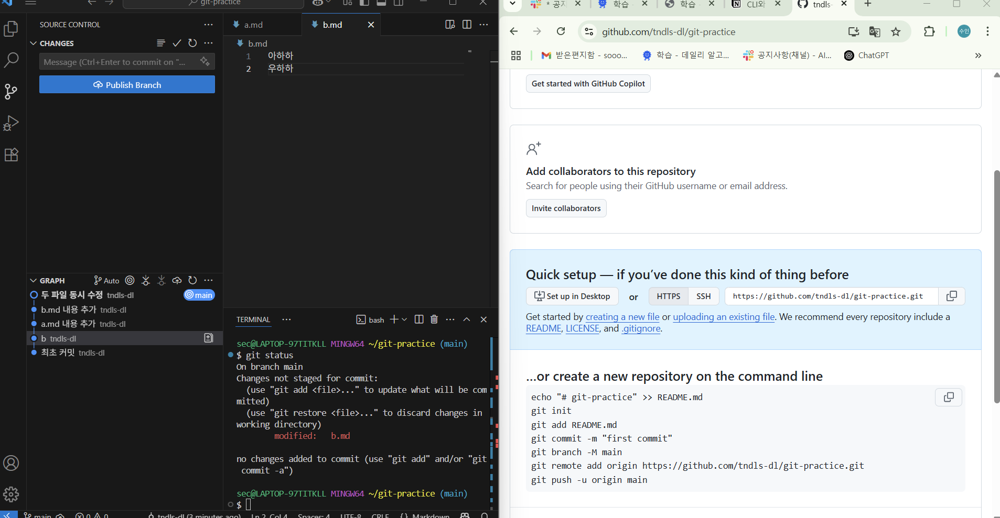
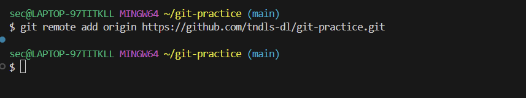
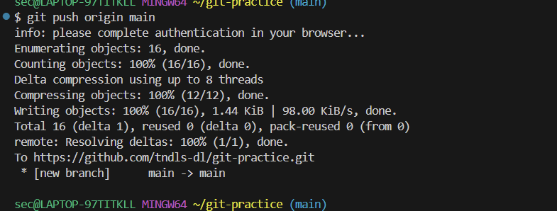
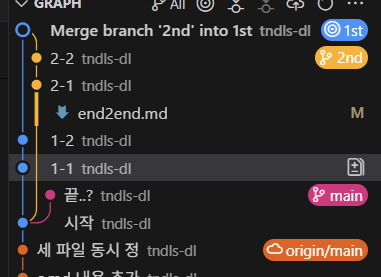

## 📁 Git vs. GitHub

| 구분 | 설명 | 비유 |
| --- | --- | --- |
| **Git** | 버전 관리 도구 (내 컴퓨터에서 파일 변경 이력을 추적) | **사진작가**: 작업할 때마다 찰칵! 버전 기록 |
| **GitHub** | Git 저장소를 온라인에서 저장·관리하는 공간 | **사진첩 / 클라우드 드라이브**: Git으로 찍은 사진들을 업로드 |

📸**Git = 사진기**, ☁️**GitHub = 사진첩 / 드라이브**

애플 사진첩과 아이클라우드가 다른 것처럼, Git과 GitHub도 다름!

---

## 📸 Git 기본 개념

Git은 마치 사진작가가 사진을 찍고 앨범에 정리하는 과정과 비슷함 !

| 비유 | Git에서의 의미 | 관련 명령어 / 설명 |
| --- | --- | --- |
| **스튜디오** | 전체 작업 공간 | Git 저장소 폴더 (프로젝트 디렉토리) |
| **분장실** | 작업 중인 상태 | 파일 수정, 생성, 삭제 등 |
| **무대** | **스테이지(Stage)** = commit 전 준비 공간 | `git add <파일>` 스테이지에 올리기 |
| **사진 찍기** | 현재 상태를 저장 (버전 기록) | `git commit -m "메시지"` 스냅샷 찍기 |

커밋은 **버전 스냅샷**,

스테이지는 **무대**,

Git은 **카메라**,

GitHub은 **클라우드 사진첩**

---

## 🧰 명령어 정리

| 명령어 | 설명 |
| --- | --- |
| `git init` | 현재 폴더를 Git 저장소로 초기화 (`.git` 폴더 생성) |
| `git add <파일>` | 스테이지에 올리기 (commit 전 준비) |
| `git add .` | 현재 폴더의 모든 변경 사항 올리기 |
| `git commit -m "메시지"` | 현재 스테이지 상태를 commit (버전 스냅샷 저장) |
| `git status` | 상태 확인 (무대에 올라간 것, 아닌 것 구분) |
| `git config --global user.name "이름"` | 사용자 이름 등록 |
| `git config --global user.email "이메일"` | 사용자 이메일 등록 |
| `rm -r .git` | Git 초기화 제거 (폴더를 Git 저장소에서 해제) |

💡.git은 숨김 폴더 (ls -a로 확인 가능)

rm -rf (f는 false를 의미)는 모든 걸 강제로 삭제할 수 있으니 매우 주의!

ctrl + c로 명령 중단 가능, ‘ctrl + `'로 터미널 열기

---

## 🧪 실습 예시

1. 새 파일 추가 (`b.md` 만들기)
2. `git add` 명령어로 스테이지에 올리기
3. `git commit -m "새 파일 추가"`로 사진 찍기 (= 버전 저장)

```bash
touch [b.md](http://b.md/)
git add [b.md](http://b.md/)
git commit -m '새 파일 추가'
```

---

## ✅ 초록색 vs. 빨간색



- 초록색 = 스테이지에 올라간 파일 → commit 대상
- 빨간색 = 아직 스테이지에 올라가지 않은 파일 → commit 불가 !

`git add .` → 모든 변경 사항 스테이지로 올리기



- 같은 파일일지라도 스테이지에 올라가 있는 파일만 commit 대상
- 아래 빨간색에 있는 파일도 스테이지에 올리면 commit 가능

---

## 🔁 되돌리기



- `git restore <file>` 과 같이 명령어로 되돌리기 가능
- discard changes 버튼을 눌러도 가능 (VS Code)

---

## 🔗 GitHub와 연결

1. **원격 저장소 만들기**: GitHub에 빈 repo 생성



📌 왼쪽 = 원격 (origin), 오른쪽 = 로컬 내 분신

1. **내 로컬을 origin과 연결**: `git remote add origin <URL>` 



1. **push로 업로드**: 내 작업을 GitHub로 전송



📌 push는 "내 사진첩에 올리는 행위"!

---

## 🌿 Git Branch(브랜치)

- 브랜치는 **점도 선도 아닌 스티커** → "지금 여기서 작업하고 있어요!" 라고 라벨 붙이는 개념

| 요소 | 설명 |
| --- | --- |
| 브랜치 | 이름표(스티커), 현재 작업 위치 표시 |
| 커밋 | 점 |
| 브랜치 이동 | `git switch <브랜치>` |
| 병합 | `git merge <브랜치>` |

✔ 파란 글씨 = repo & 현재 내가 있는 브랜치

✔ `git switch 2nd` → 2nd 브랜치로 이동

✔ 브랜치는 동시에 여러 방향으로 나뉠 수 있음 (가지처럼 보이지만 실제로는 스티커!)

✔ 메시지는 중복돼도 상관 없음 

- 동시에 여러 사람이 각자 기능 개발 가능 → 충돌 없이 독립적인 작업 후 병합
- 커밋은 점이고, 브랜치는 단순히 "어디 보고 있을지" 표시하는 스티커!



- 왼쪽의 가지가 브랜치가 아니라, 오른쪽의 스티커들이 브랜치 !

---

### 🔀 브랜치 병합 (Merge)

ex ) 내가 1st 브랜치에 있을 때 2nd 브랜치를 병합하고 싶다면 ?

→ `git merge 2nd`

✔ 병합 충돌이 나면, 원하는 버전 선택(지우는 것도 가능!)하고 저장 → commit까지 해야 진짜 병합 완료됨!