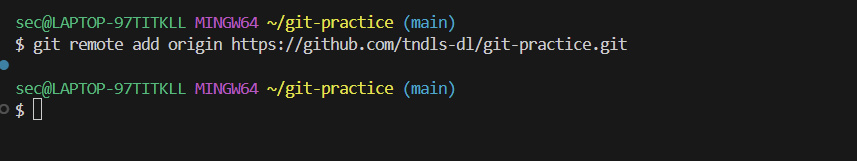
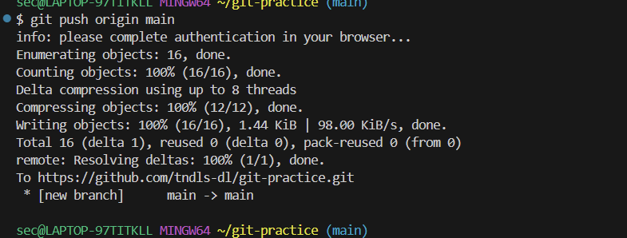

# 🗃️ Git

## 📁 Git vs. GitHub

| 구분 | 설명 | 비유 |
| --- | --- | --- |
| **Git** | 버전 관리 도구 (내 컴퓨터에서 파일 변경 이력을 추적) | **사진작가**: 작업할 때마다 찰칵! 버전 기록 |
| **GitHub** | Git 저장소를 온라인에서 저장·관리하는 공간 | **사진첩 / 클라우드 드라이브**: Git으로 찍은 사진들을 업로드 |

📸**Git = 사진기**, ☁️**GitHub = 사진첩 / 드라이브**

애플 사진첩과 아이클라우드가 다른 것처럼, Git과 GitHub도 다름!

---

## 📸 Git 기본 개념

Git은 마치 사진작가가 사진을 찍고 앨범에 정리하는 과정과 비슷함 !

| 비유 | Git에서의 의미 | 관련 명령어 / 설명 |
| --- | --- | --- |
| **스튜디오** | 전체 작업 공간 | Git 저장소 폴더 (프로젝트 디렉토리) |
| **분장실** | 작업 중인 상태 | 파일 수정, 생성, 삭제 등 |
| **무대** | **스테이지(Stage)** = commit 전 준비 공간 | `git add <파일>` 스테이지에 올리기 |
| **사진 찍기** | 현재 상태를 저장 (버전 기록) | `git commit -m "메시지"` 스냅샷 찍기 |

커밋은 **버전 스냅샷**,

스테이지는 **무대**,

Git은 **카메라**,

GitHub은 **클라우드 사진첩**

---

## 🧰 명령어 정리

| 명령어 | 설명 |
| --- | --- |
| `git init` | 현재 폴더를 Git 저장소로 초기화 (`.git` 폴더 생성) |
| `git add <파일>` | 스테이지에 올리기 (commit 전 준비) |
| `git add .` | 현재 폴더의 모든 변경 사항 올리기 |
| `git commit -m "메시지"` | 현재 스테이지 상태를 commit (버전 스냅샷 저장) |
| `git status` | 상태 확인 (무대에 올라간 것, 아닌 것 구분) |
| `git config --global user.name "이름"` | 사용자 이름 등록 |
| `git config --global user.email "이메일"` | 사용자 이메일 등록 |
| `rm -r .git` | Git 초기화 제거 (폴더를 Git 저장소에서 해제) |

💡
- git init은 저장소가 아닌 일반 폴더에서 최초 1회만 실행하는 명령어
    - 실행하면 현재 위치한 폴더고 Git 저장소로 초기화
    - .git은 숨김 폴더 (ls -a로 확인 가능)
- rm -rf (f는 false를 의미)는 모든 걸 강제로 삭제할 수 있으니 매우 주의!
- ctrl + c로 명령 중단 가능, ‘ctrl + `'로 터미널 열기

---

## 🧪 실습 예시

1. 새 파일 추가 (`b.md` 만들기)
2. `git add` 명령어로 스테이지에 올리기
3. `git commit -m "새 파일 추가"`로 사진 찍기 (= 버전 저장)

```bash
touch [b.md](http://b.md/)
git add [b.md](http://b.md/)
git commit -m '새 파일 추가'
```
- **`git commit`**
    - add로 준비한 파일들을 하나의 저장 단위로 기록
    - “지금까지의 작업 내용을 이렇게 저장하겠다”는 의미
    - 커밋에는 반드시 메시지를 함께 작성 → `git commit -m "메시지"` 처럼 사용

---

## ✅ 초록색 vs. 빨간색


- 초록색 = 스테이지에 올라간 파일 → commit 대상
- 빨간색 = 아직 스테이지에 올라가지 않은 파일 → commit 불가 !

`git add .` → 모든 변경 사항 스테이지로 올리기


- 같은 파일일지라도 스테이지에 올라가 있는 파일만 commit 대상
- 아래 빨간색에 있는 파일도 스테이지에 올리면 commit 가능

---

## 🔁 되돌리기


- `git restore <file>` 과 같이 명령어로 되돌리기 가능
- discard changes 버튼을 눌러도 가능 (VS Code)

---

## 🔗 GitHub와 연결

1. **원격 저장소 만들기**: GitHub에 빈 repo 생성


📌 왼쪽 = 원격 (origin), 오른쪽 = 로컬 내 분신

- **`git clone`** : 원격 저장소를 내 컴퓨터에 처음으로 복제
    - 처음 프로젝트를 시작하거나 다른 사람의 프로젝트를 받아올 때 사용
    - 복제하면 `.git` 폴더까지 함께 받아와 Git으로 관리 가능해짐

1. **내 로컬을 origin과 연결**: `git remote add origin <URL>` 



- **`git remote add origin`**
    - 로컬 저장소와 원격 저장소를 연결
    - origin은 연결된 원격 저장소의 이름 (보통 기본값으로 origin 사용)
    - 이후 `push`, `pull` 등을 할 수 있게 됨


1. **push로 업로드**: 내 작업을 GitHub로 전송



📌 push는 "내 사진첩에 올리는 행위"!
- **`git push`**
    - 로컬 저장소에서 commit한 내용을 원격 저장소 (GitHub 등)로 업로드
    - 협업 시 다른 사람도 내가 한 작업을 볼 수 있도록 공유
    - `git push origin 브랜치명` 으로 특정 브랜치를 올림

- **`git pull`**
    - 원격 저장소의 변경 내용을 내 로컬 저장소로 가져와 병합
    - 다른 사람이 푸시한 내용을 받아올 때 사용
    - `git pull origin 브랜치명` 으로 해당 브랜치의 최신 내용을 가져옴

---

## 🌿 Git Branch(브랜치)

- 브랜치는 **점도 선도 아닌 스티커** → "지금 여기서 작업하고 있어요!" 라고 라벨 붙이는 개념

| 요소 | 설명 |
| --- | --- |
| 브랜치 | 이름표(스티커), 현재 작업 위치 표시 |
| 커밋 | 점 |
| 브랜치 이동 | `git switch <브랜치>` |
| 병합 | `git merge <브랜치>` |

✔ 파란 글씨 = repo & 현재 내가 있는 브랜치

✔ `git switch 2nd` → 2nd 브랜치로 이동

✔ 브랜치는 동시에 여러 방향으로 나뉠 수 있음 (가지처럼 보이지만 실제로는 스티커!)

✔ 메시지는 중복돼도 상관 없음 

- 동시에 여러 사람이 각자 기능 개발 가능 → 충돌 없이 독립적인 작업 후 병합
- 커밋은 점이고, 브랜치는 단순히 "어디 보고 있을지" 표시하는 스티커!


- 왼쪽의 가지가 브랜치가 아니라, 오른쪽의 스티커들이 브랜치 !

- **`git branch`** : 현재 존재하는 브랜치 목록 확인
    - 브랜치는 독립적인 작업 공간
    - 기존 코드에 영향을 주지 않고 새로운 기능을 실험하거나 개발할 때 사용
    - `git branch 브랜치명` 은 새 브랜치를 생성
    - 현재 어떤 브랜치에 있는지는 `*` 표시로 확인

- **`git switch`** : 다른 브랜치로 이동하거나 새 브랜치를 생성하고 이동
    - `git switch 브랜치명` 은 기존 브랜치로 이동
    - `git switch -c 새브랜치명` 은 새 브랜치를 만들고 그 브랜치로 이동
    - 예전에는 `git checkout` 을 사용했지만, `switch` 가 더 명확하고 직관적

---

### 🔀 브랜치 병합 (Merge)

- **`git merge`** : 다른 브랜치에서 작업한 내용을 현재 브랜치에 합치는 명령
    - 병합 후에는 브랜치를 삭제해도 됨 (`git branch -d 브랜치명`)

ex ) 내가 1st 브랜치에 있을 때 2nd 브랜치를 병합하고 싶다면 ?

→ `git merge 2nd`

✔ 병합 충돌이 나면, 원하는 버전 선택(지우는 것도 가능!)하고 저장 → commit까지 해야 진짜 병합 완료됨!

---

## **💡** 간단한 흐름 예시

1. 작업 시작 : `git clone` 또는 `git switch -c 새브랜치`
2. 파일 수정 후 : `git add`, `git commit`
3. 작업 공유 : `git push`
4. 다른 사람의 작업 반영 : `git pull`
5. 기능 개발 끝나면 : `git switch main`, `git merge 작업브랜치`
6. 정리 : `git branch -d 작업브랜치`

---

## 🔍 기타 Detail

1️⃣ **`git log`** : commit 기록을 보는 기본 명령어

```bash
git log  # 상세 커밋 내역
git log --oneline  # 요약 보기
```

- commit ID, 작성자, 메시지 확인 가능
- `q` 로 종료

2️⃣ **`.gitignore`** 

```bash
# .gitignore 예시
node_modules/
.env
*.log
```

- `.gitignore` 파일에 무시할 파일/폴더를 적으면 Git이 추적하지 않음
- 예 : `node_modules/`, `.env` 등 민감하거나 불필요한 파일 제외할 때 사용

3️⃣ **`git diff`** : commit 전 변경 내용 비교.

```bash
git diff  # 워킹 디렉토리와 스테이지 비교
git diff --staged  # 스테이지와 마지막 커밋 비교
```

- 실제로 `commit` 전에 변경 내용을 확인할 때 아주 자주 씀

4️⃣ 협업 팁: **`pull`** 전에 **`commit`**

- `git pull` 하기 전에 로컬 변경 사항을 commit 또는 stash 해야 충돌 방지
- `git stash`는 임시로 변경 사항 보관 → pull → 다시 적용 가능

5️⃣ 충돌 예시 간략 설명

- `merge`에서 충돌 나면 `<<<<<<<`, `=======`, `>>>>>>>` 표시로 충돌 부분 나타남.
- 원하는 쪽 코드만 남기고 저장 → `git add` → `git commit` 하면 병합 완료!

---

## ✨ Tip

- `git clone` 후 바로 `cd` 해서 작업 시작하기.
- VS Code에서 `.git` 숨김폴더 보려면 `Ctrl + Shift + .` (윈도우 기준)
- `origin` 외에도 원격 저장소 여러 개(`upstream`) 쓸 수 있음 → 포크(Fork)한 오픈소스 협업 때 유용.

---

- **📌** **포크(Fork)**란 ?
    - Fork(포크) 는 다른 사람의 깃허브 저장소를 내 깃허브 계정으로 ‘복사’하는 것이에요.
    - 주로 오픈소스(누구나 참여할 수 있는 공개 프로젝트)를 수정하거나 기여하고 싶을 때 사용해요.
    - 원본 저장소는 건드릴 수 없으니까, 내 계정에 복사본을 만들어 작업한 뒤 PR(Pull Request) 로 원본에 반영을 요청하는 구조!

- **Fork → Clone → Upstream 연결 → 최신 동기화 → PR 보내기** 흐름
    - **1️⃣ Fork (포크하기)**
    ✔ **의미** : 다른 사람의 깃허브 저장소를 **내 깃허브 계정으로 복사** → 원본은 못 만지니까, 내 공간에 복제해서 마음껏 실험!
        
        ✔ **비유** : 다른 사람이 만든 요리 레시피북을 **내 노트에 복사**한 뒤, 내가 원하는 대로 추가·수정하고, 원본에 다시 보내는 것!
        
        **2️⃣ Clone (내 컴퓨터로 복제)**
        
        ✔ **명령어** :
        
        ```bash
        git clone <내 포크 저장소 주소>
        ```
        
        ✔ **결과** : 
        
        - 내 깃허브 계정에 복사된 저장소(origin)를 **내 컴퓨터에 내려받음,**
        - `.git` 폴더까지 같이 와서 Git으로 관리됨
        
        3️⃣ **Upstream 연결 (원본 저장소 주소 추가)**
        
        ✔ **왜 필요? :** 
        
        - 내 포크는 원본과 별개라서, 원본에 누군가 새로운 코드를 추가하면 내가 모름 !
        - 원본을 `upstream` 으로 연결하면 언제든 **원본 최신 버전 가져오기** 가능.
        
        ✔ **명령어** :
        
        ```bash
        git remote add upstream <원본 저장소 주소>
        ```
        
        ✔ **비유** : 내 복사본 노트에 원본 책 주소를 적어두고, 필요할 때 원본 내용을 다시 베껴올 수 있게 만드는 것 !
        
        **4️⃣ 원본과 내 포크 동기화**
        
        ✔ **흐름** : 원본(upstream)의 최신 commit을 내 로컬에 가져오고 → 내 origin에도 반영.
        
        ✔ **명령어 예시** :
        
        ```bash
        # 1) 원본에서 최신 내용 가져오기
        git fetch upstream
        
        # 2) 내 브랜치에 병합하기
        git merge upstream/main
        
        # 또는 최신 내용 가져오고 재배치(rebase)
        git rebase upstream/main
        ```
        
        **5️⃣ Push 해서 내 포크 원격 저장소에 업로드**
        
        ✔ 원본에서 가져온 최신 내용이 내 로컬에 반영됐으면, 내 GitHub (origin)에도 올려야 함!
        
        ```bash
        git push origin main
        ```
        
        **6️⃣ Pull Request (PR) 보내기**
        
        ✔ 내 포크(origin)에서 수정한 내용을 원본 저장소(upstream)에 반영 요청하는 것!
        
        ✔ 깃허브 사이트에서 버튼 클릭으로 보내면 됨 →
        
        👉 **Pull Request** = “내가 수정한 거 원본에도 합쳐주세요~!”
        
        🔗 **전체 흐름 요약**
        
        ```
        원본 저장소 ----(Fork)----> 내 깃허브(origin) ----(Clone)----> 내 컴퓨터
        원본 저장소 ----(Upstream) 연결----> 내 컴퓨터
        
        원본 최신 내용 가져오기 → merge → push → PR
        ```
        
        ✅ **자주 하는 실수**
        
        - `origin`과 `upstream` 헷갈려서 반대 주소로 연결하는 것
        - `clone` 후 `upstream` 안 걸어놔서 최신 코드 못 가져오는 것
        - 원본 PR 보내기 전에 꼭 충돌 여부 확인해야 함!